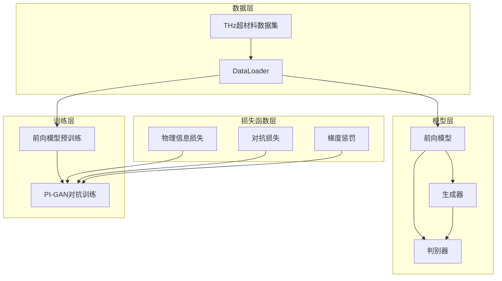
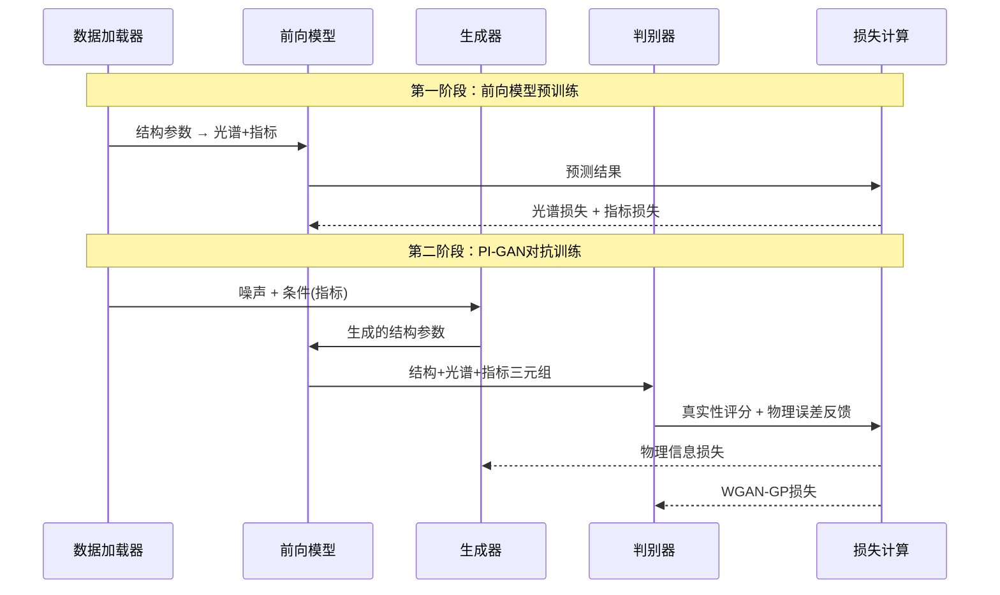

# PI_GAN_THz项目代码扫描报告

## 概述

本报告针对PI_GAN_THz项目进行了全面的代码扫描分析，评估了项目的整体架构、代码质量、潜在问题和改进空间。项目实现了一个物理信息生成对抗网络（PI-GAN），用于太赫兹超材料的逆向设计。

### 项目结构
```
PI_GAN_THz/
├── config/config.py          # 全局配置文件
├── core/
│   ├── models/               # 神经网络模型定义
│   │   ├── forward_model.py  # 前向物理代理模型
│   │   ├── generator.py      # 条件生成器
│   │   └── discriminator.py  # 多分支判别器
│   ├── train/                # 训练脚本
│   │   ├── pretrain_forward_model.py  # 前向模型预训练
│   │   └── train_pigan.py    # PI-GAN对抗训练
│   ├── utils/                # 工具函数
│   │   ├── data_loader.py    # 数据加载器
│   │   └── loss.py           # 损失函数实现
│   └── evaluate/             # 评估模块
│       ├── evaluator.py      # 模型评估脚本
│       └── evaluate_forward_model.py
└── dataset/                  # 数据集目录
    └── THz_Metamaterial_Spectra_With_Metrics.csv
```

## 架构分析

### 核心组件架构



### 训练流程架构



## 代码质量分析

### 优点

#### 1. 模块化设计
- **清晰的分层架构**：配置、模型、训练、工具分离明确
- **可复用组件**：各模块功能独立，便于维护和扩展
- **统一配置管理**：config.py集中管理所有超参数

#### 2. 物理约束集成
- **物理信息损失**：巧妙结合对抗损失、光谱损失、指标损失和物理误差反馈
- **可微分特征提取器**：DifferentiableSpectralFeatureExtractor实现物理规律约束
- **结构参数投影器**：StructuralParamProjector确保生成结果符合物理边界

#### 3. 训练稳定性措施
- **梯度裁剪**：防止梯度爆炸
- **谱归一化**：在判别器中使用，提升训练稳定性
- **学习率调度**：ReduceLROnPlateau自适应调整学习率
- **早停机制**：防止过拟合

#### 4. 多模态判别
- **三分支架构**：分别处理结构、光谱、指标三种模态
- **物理误差反馈**：学习型+规则型双重物理约束

### 问题识别

#### 1. 关键问题

##### 数据处理问题
- **数据泄露风险**：在`data_loader.py`中，scalers仅在训练集上拟合，但缺乏对验证/测试集数据分布检查
- **NaN处理不统一**：多处使用`torch.nan_to_num()`，但缺乏统一的NaN检测和报告机制

##### 训练流程问题
- **前向模型依赖**：PI-GAN训练强依赖预训练的前向模型，但缺少前向模型质量验证
- **条件生成不均衡**：使用真实指标作为条件，可能导致生成器过度拟合特定指标分布

##### 物理约束问题
- **硬编码边界**：STRUCT_MIN_BOUNDS和STRUCT_MAX_BOUNDS需要手动设置，缺乏自动检测机制
- **物理规律验证不足**：DifferentiableSpectralFeatureExtractor的物理假设（如Gaussian谱形）可能不适用于所有情况

#### 2. 潜在风险

##### 数值稳定性
- **除零风险**：多处使用小的epsilon值，但在极端情况下仍可能出现数值不稳定
- **梯度消失/爆炸**：虽然有梯度裁剪，但深层网络仍可能存在梯度问题

##### 内存和计算效率
- **重复计算**：前向模型在训练中被多次调用，缺乏计算缓存
- **GPU内存管理**：大批次训练时可能出现OOM问题

##### 可扩展性限制
- **固定维度假设**：代码中硬编码了光谱维度(250)和指标维度(8)
- **单一数据集结构**：数据加载器针对特定CSV结构设计，缺乏泛化性

#### 3. 代码质量问题

##### 错误处理不足
```python
# 示例：缺乏异常处理
forward_model.load_state_dict(torch.load(model_path))  # 可能失败但未处理
```

##### 魔术数字
```python
# 示例：硬编码的数值
if i % 5 == 0:  # 训练频率硬编码
    # 训练生成器
```

##### 注释不完整
- 部分复杂算法缺乏详细注释
- 物理公式和假设缺乏文档说明

## 改进建议

### 1. 高优先级改进

#### 数据处理增强
```python
# 建议添加数据质量检查
class DataQualityChecker:
    @staticmethod
    def check_data_distribution(train_data, val_data, test_data):
        """检查数据分布一致性"""
        pass
    
    @staticmethod
    def detect_outliers(data, method='iqr'):
        """检测异常值"""
        pass
    
    @staticmethod
    def validate_data_integrity(data):
        """验证数据完整性"""
        pass
```

#### 配置验证机制
```python
# 建议添加配置验证
class ConfigValidator:
    @staticmethod
    def validate_bounds():
        """验证结构参数边界设置"""
        pass
    
    @staticmethod
    def validate_dimensions():
        """验证网络维度一致性"""
        pass
```

#### 训练监控增强
```python
# 建议添加训练监控
class TrainingMonitor:
    def __init__(self):
        self.losses = defaultdict(list)
        self.metrics = defaultdict(list)
    
    def log_batch_metrics(self, metrics_dict):
        """记录批次指标"""
        pass
    
    def check_convergence(self):
        """检查收敛性"""
        pass
```

### 2. 中优先级改进

#### 物理约束增强
- **自适应边界检测**：根据数据集自动推断合理的结构参数范围
- **多物理模型支持**：支持不同的光谱形状假设
- **物理一致性验证**：添加更严格的物理规律检验

#### 模型架构优化
- **注意力机制**：在判别器中引入注意力机制提升特征融合
- **残差连接**：在深层网络中添加skip connections
- **批归一化优化**：使用更稳定的归一化方法

#### 训练策略改进
- **渐进式训练**：从简单到复杂逐步训练
- **多尺度损失**：在不同分辨率上计算损失
- **自适应权重调整**：动态调整各损失项权重

### 3. 低优先级改进

#### 代码重构
- **统一异常处理**：建立统一的异常处理框架
- **日志系统**：引入结构化日志记录
- **单元测试**：为核心组件添加单元测试

#### 性能优化
- **计算缓存**：缓存重复计算结果
- **并行化**：利用多GPU训练
- **内存优化**：优化内存使用模式

#### 用户体验
- **CLI工具**：提供命令行接口
- **可视化增强**：添加更多分析图表
- **文档完善**：补充API文档和使用示例

## 具体修复方案

### 1. 数据处理修复

#### 添加数据质量检查
在`data_loader.py`中添加：
```python
def validate_data_quality(df):
    """数据质量检查"""
    # 检查缺失值
    missing_ratio = df.isnull().sum() / len(df)
    if missing_ratio.max() > 0.1:
        warnings.warn(f"数据缺失率过高: {missing_ratio.max():.2%}")
    
    # 检查异常值
    numeric_cols = df.select_dtypes(include=[np.number]).columns
    for col in numeric_cols:
        Q1, Q3 = df[col].quantile([0.25, 0.75])
        IQR = Q3 - Q1
        outliers = ((df[col] < (Q1 - 1.5 * IQR)) | (df[col] > (Q3 + 1.5 * IQR))).sum()
        if outliers > len(df) * 0.05:
            warnings.warn(f"列 {col} 异常值过多: {outliers}")
```

### 2. 训练流程增强

#### 添加前向模型质量验证
在`train_pigan.py`训练开始前添加：
```python
def validate_forward_model(forward_model, val_loader):
    """验证前向模型质量"""
    forward_model.eval()
    total_loss = 0
    with torch.no_grad():
        for batch in val_loader:
            struct = batch['struct'].to(config.DEVICE)
            target_spectra = batch['spectra'].to(config.DEVICE)
            
            pred_spectra, _ = forward_model(struct)
            loss = F.mse_loss(pred_spectra, target_spectra)
            total_loss += loss.item()
    
    avg_loss = total_loss / len(val_loader)
    if avg_loss > 0.1:  # 根据实际情况调整阈值
        raise ValueError(f"前向模型质量不足，验证损失: {avg_loss:.6f}")
```

### 3. 物理约束改进

#### 自动边界检测
```python
def auto_detect_bounds(data, percentile=1):
    """自动检测结构参数边界"""
    lower_bounds = np.percentile(data, percentile, axis=0)
    upper_bounds = np.percentile(data, 100-percentile, axis=0)
    
    # 添加安全边距
    margin = 0.05 * (upper_bounds - lower_bounds)
    lower_bounds -= margin
    upper_bounds += margin
    
    return lower_bounds.tolist(), upper_bounds.tolist()
```

## 风险评估

### 高风险项
1. **数据质量问题**：可能导致模型性能严重下降
2. **前向模型依赖**：前向模型失效将影响整个PI-GAN训练
3. **物理约束失效**：可能生成物理上不可实现的结构

### 中风险项  
1. **数值不稳定**：可能导致训练中断或结果不可靠
2. **内存溢出**：大规模训练时的资源限制
3. **收敛问题**：GAN训练的固有不稳定性

### 低风险项
1. **代码维护性**：影响长期开发效率
2. **性能优化**：影响训练速度但不影响结果
3. **用户体验**：影响使用便利性

## 测试建议

### 单元测试
- **模型组件测试**：测试各神经网络模块的输入输出
- **损失函数测试**：验证损失计算的正确性
- **数据处理测试**：检查数据预处理和后处理

### 集成测试  
- **端到端训练**：使用小数据集验证完整训练流程
- **模型保存加载**：验证模型序列化和反序列化
- **跨设备兼容性**：测试CPU/GPU切换

### 性能测试
- **内存使用**：监控训练过程内存消耗
- **训练速度**：测量不同配置下的训练效率
- **生成质量**：评估生成样本的物理合理性