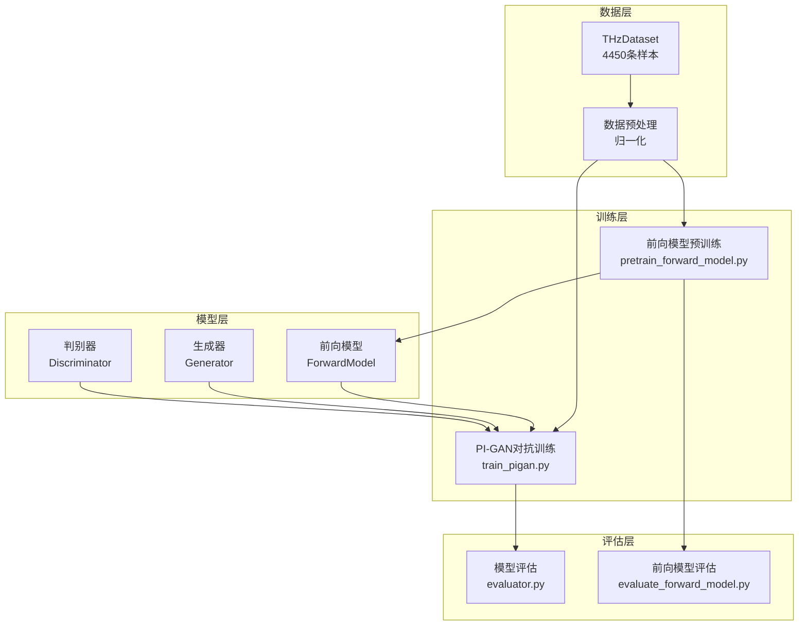
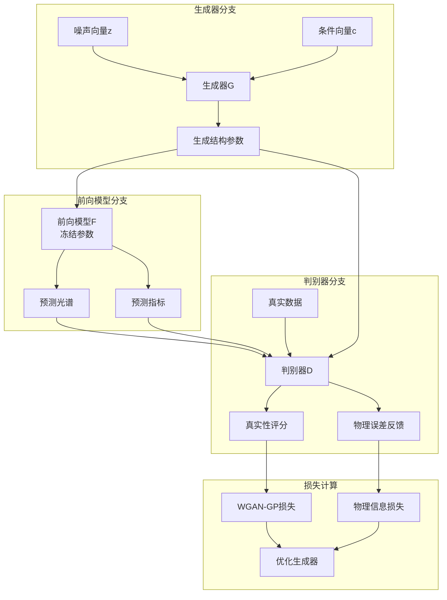
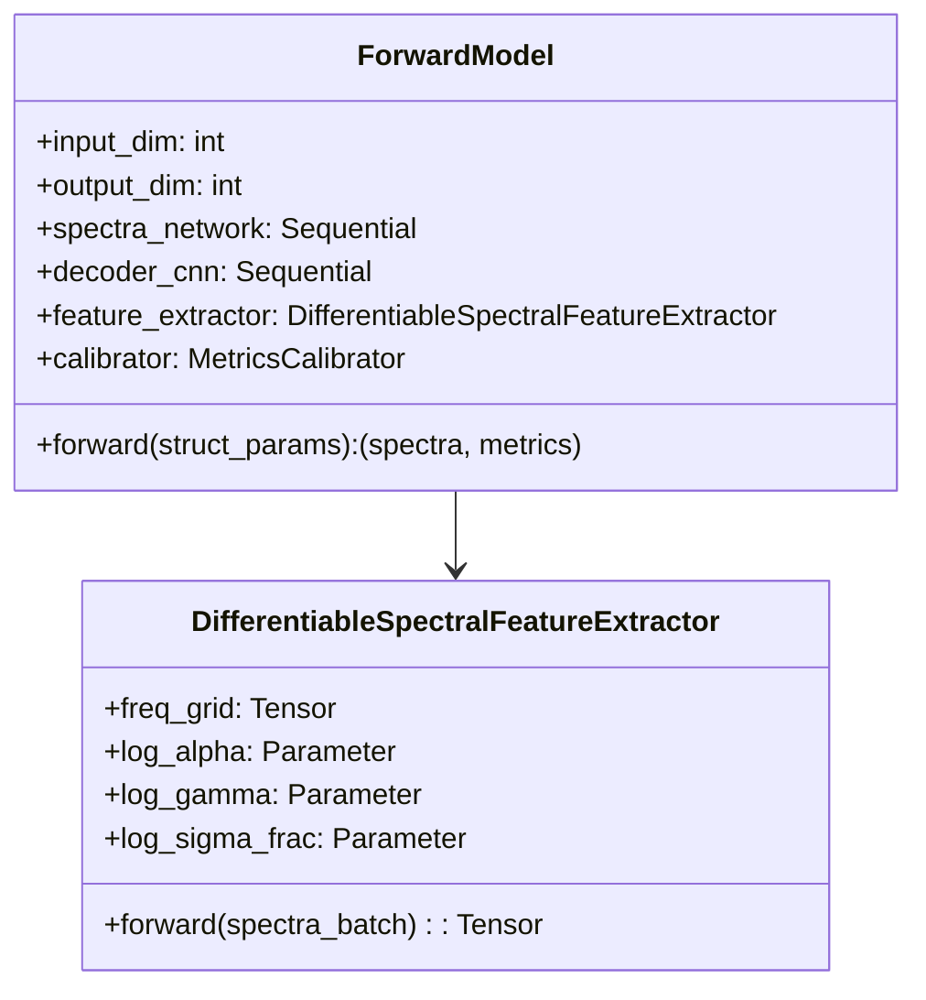
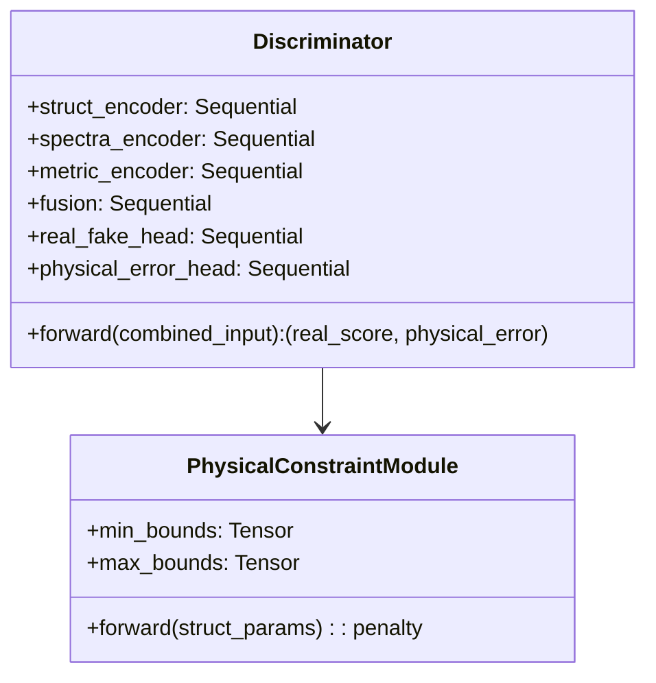
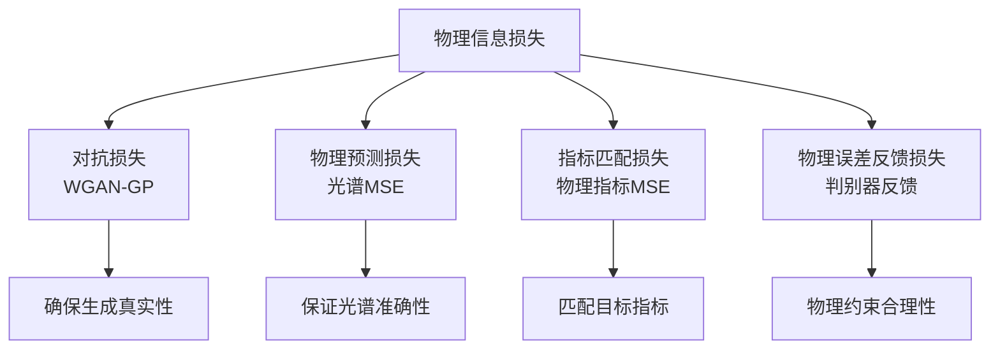
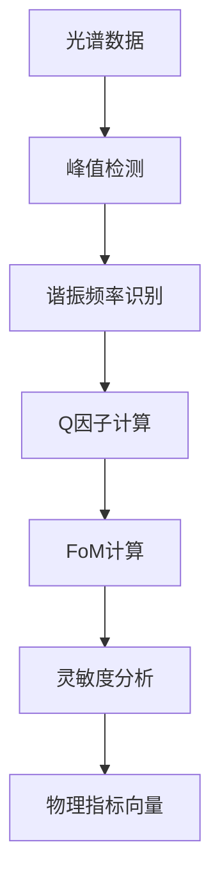
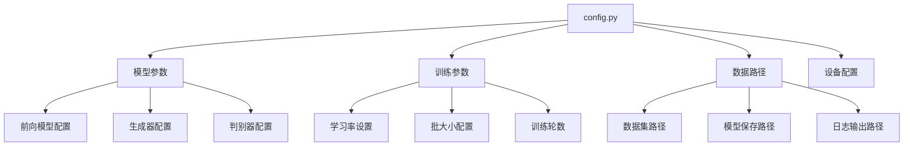
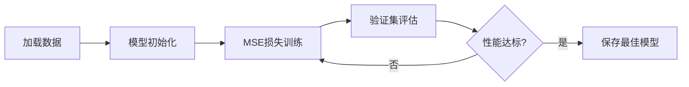
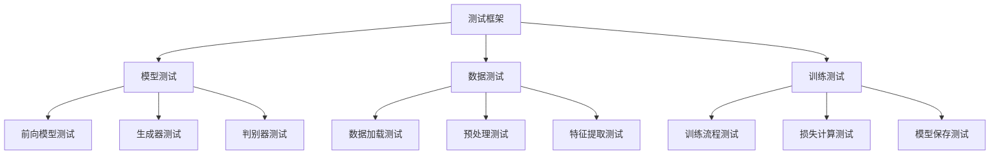

# PI_GAN_THz 项目概览

## 项目简介

PI_GAN_THz是一个基于物理信息生成对抗网络（Physics-Informed GAN）的太赫兹超材料逆向设计框架。该项目旨在解决传统电磁仿真优化方法效率低、耗时长的问题，通过深度学习实现从目标光谱特征反向生成符合物理规律的超材料结构参数。

### 核心价值
- **高效逆向设计**: 从目标光谱特征生成可行的超材料结构参数
- **物理约束保证**: 通过物理信息损失确保生成结构的物理有效性
- **端到端流程**: 提供完整的训练、评估与可视化工作流

### 应用场景
- 超材料结构优化设计
- 太赫兹器件性能预测
- 电磁特性快速仿真
- 材料科学研究辅助

## 技术架构

### 整体架构设计

### 两阶段训练流程

#### 第一阶段：前向模型预训练

#### 第二阶段：PI-GAN对抗训练

### 核心组件详解

#### 前向模型（ForwardModel）
- **功能**: 结构参数 → 光谱响应映射
- **架构**: MLP编码器 + CNN解码器
- **输入**: 超材料结构参数
- **输出**: 透射光谱 + 物理指标（谐振频率、Q因子、FoM、灵敏度）

#### 生成器（Generator）
- **功能**: 条件生成结构参数
- **输入**: 随机噪声 + 条件向量（目标物理指标）
- **输出**: 超材料结构参数
- **架构**: 深层MLP网络

#### 判别器（Discriminator）
- **功能**: 多模态真实性判别 + 物理误差反馈
- **架构**: 三分支网络设计

### 物理信息损失机制

#### 损失函数组成

#### 损失权重配置
| 损失类型 | 权重 | 作用 |
|---------|------|------|
| 对抗损失 | 1.0 | 基础真实性 |
| 物理预测损失 | 10.0 | 光谱匹配 |
| 指标匹配损失 | 5.0 | 性能指标 |
| 物理误差反馈 | 2.0 | 约束违反惩罚 |

## 数据架构

### 数据集特征
- **样本数量**: 4450条
- **输入维度**: 结构参数（多维）
- **输出维度**: 250维光谱 + 4维物理指标

### 数据预处理流程

### 物理指标提取

## 配置管理

### 全局配置架构

### 关键参数配置

#### 模型结构参数
| 参数名 | 默认值 | 说明 |
|-------|--------|------|
| LATENT_DIM | 128 | 生成器潜在空间维度 |
| CONDITION_DIM | 4 | 条件向量维度 |
| STRUCT_DIM | variable | 结构参数维度 |
| SPECTRA_DIM | 250 | 光谱维度 |

#### 训练超参数
| 参数名 | 默认值 | 说明 |
|-------|--------|------|
| LEARNING_RATE | 0.0002 | 学习率 |
| BATCH_SIZE | 64 | 批大小 |
| NUM_EPOCHS | 1000 | 训练轮数 |
| LAMBDA_GP | 10.0 | 梯度惩罚权重 |

## 训练与评估策略

### 训练策略

#### 前向模型预训练

#### PI-GAN对抗训练

### 评估指标

#### 前向模型评估
| 指标 | 计算方式 | 目标值 |
|------|----------|--------|
| 光谱MSE | MSE(pred_spectra, true_spectra) | < 0.01 |
| 指标MAE | MAE(pred_metrics, true_metrics) | < 5% |
| R²得分 | R²(pred, true) | > 0.95 |

#### 生成器评估
| 指标 | 计算方式 | 目标值 |
|------|----------|--------|
| 物理有效性 | 约束违反率 | < 1% |
| 光谱相似度 | 余弦相似度 | > 0.9 |
| 指标匹配度 | 相对误差 | < 10% |

## 模块测试策略

### 单元测试覆盖

### 测试用例设计
- **模型前向传播测试**: 验证输入输出维度一致性
- **损失函数测试**: 确保梯度计算正确性
- **数据管道测试**: 验证数据预处理流程
- **物理约束测试**: 检查生成结构的物理合理性
- **端到端测试**: 完整训练流程验证
